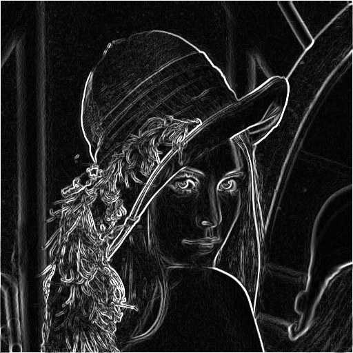

# Sobel/Prewitt/Roberts/Scharr Edge Detector 

A Sobel/Prewitt/Roberts/Scharr Edge Detection Filter written in OpenCL and C++ . The library makes use of FreeImage to load and save image files.

## Example

Here's what the library does:
 
Original Image:
 

 
Sobel:
 

 
Prewitt:
 

 
Roberts:
 

 
Scharr:
 

## Usage

The RunSobel.cpp gives an example of how to use the library. It is outlined here:

    #include "SobelFilter.h"
	...

	std::string Path = "myimage.bmp";

	// Declare the edge detector
	SobelFilter EdgeDetector;

	// Load the image from the file
	EdgeDetector.LoadImage(Path.c_str());

	// Run it
	EdgeDetector.Run();

	// Save the edge detected image
	// Use .bmp to make working with FreeImage easy
	std::string OutputPath = "sobel_" + Path + ".bmp";
	EdgeDetector.SaveImage(OutputPath.c_str());

And that's it. You'll get a file called `filterMode_image.bmp` as output.

I've included a common folder in the repo. It includes the OpenCL and FreeImage libraries needed to run
the filter. 

## Command Line Usage
See the `run.sh` file on how to compile and run the code

    g++ -c SobelFilter.cpp -lOpenCL -Icommon/OpenCL/include -Icommon/FreeImage/include -std=c++11 -o SobelFilter.a
    g++ RunSobel.cpp SobelFilter.a common/FreeImage/lib/linux/x86_64/libfreeimage.a -lOpenCL -Icommon/OpenCL/include -std=c++11 -o sobel

    ./sobel lena.bmp [sobel|prewitt|roberts|scharr]

This first compiles the SobelFilter library, then it compiles the RubSobel command line program. Once it is compiled just call `sobel` and the path to
the file you want to run it against.

Newly added is the option to specify the edge detection method:
-	Sobel
-	Prewitt
-	Roberts
-	Scharr

If not specified, the edge detector will still fallback to Sobel.

## Revision History

### 1.1.2
Added edge detection variants. (Prewitt, Roberts, Scharr).

### 1.1.1
Updated local work size to accomodate non-square or evenly divisible image sizes.

### 1.1.0
Fixed the RGB to grey scale conversion.

### 1.0.0
Initial release.
